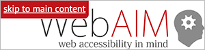

# Quick start guide

To get you started, we’ll review the essentials to start making your site accessible. Read further in this handbook to learn about [why these standards are critical](https://make.wordpress.org/accessibility/handbook/accessibility-overview/) to your site.

## Webpage Navigation

Assistive Technologies (AT) like screen-readers offer multiple ways to navigate a webpage. These include linked lists of the page’s [Headings](https://make.wordpress.org/accessibility/handbook/content/using-headings-in-content/), [Links](https://make.wordpress.org/accessibility/handbook/content/good-link-texts/), and [Landmarks](https://make.wordpress.org/accessibility/handbook/markup/aria-landmarks/).

Using these correctly improves the navigation experience for your users.

### Headings

- Put your document title in an H1 element. WordPress themes usually take responsibility for this; so verify that your theme uses an h1 when needed.
- Nest your page sections and subsections in a sequential hierarchy using H2–H6.
- Don’t skip levels. In properly nested headings an H4 is a subheading to an H3, and you would not skip from an H2 to an H4.
- Never use headings for visual effects only, e.g., to bold text or increase font size. Using the block editor’s text styling features is good for avoiding this.

### Links

- Use meaningful link text to describe the link: Never just “click here” or “more info”. The text of the link should indicate what clicking the link does. (Screen reader users often use a list of links out of context.)
- Avoid the title attribute in anchor elements (`<a>`).
- Avoid the target attribute in anchor elements. If you need to open a link in a new tab, inform the user.
- Provide :focus and :active link highlighting.
- Underline links in content. Do not rely on color alone.
- Include the document title in “Read More” links (can be hidden by the [screen-reader-text](https://make.wordpress.org/accessibility/handbook/best-practices/markup/the-css-class-screen-reader-text/) CSS class).

### Landmarks & HTML5 sectioning elements

- Use HTML sectioning elements: `<header>`, `<nav>`, `<main>` (only one `<main>` per page), `<aside>`, and `<footer>`.
- Put all parts of a webpage inside one of the above elements (leave nothing orphaned).
- Add an `aria-label` attribute to distinguish the same sectioning element used more than once. For example `<nav aria-label="Main">` vs `<nav aria-label="Social Media">`.
- On a search form: add the `search` role ([discussion about where to add the role=search](http://adrianroselli.com/2015/08/where-to-put-your-search-role.html)).

Accessibility landmarks are derived from the five primary HTML sectioning elements: `<header>`, `<nav>`, `<main>` (only one `<main>` per page), `<aside>`, and `<footer>`. All content on your page should be inside a landmark.

Some landmarks should appear only once per page: banner, main, and contentinfo, represented by the header, main, and footer section elements.

### Skip Links



Keyboard navigating users need to way to quickly skip from the top of a page directly to the content. These “[skip links](https://make.wordpress.org/accessibility/handbook/best-practices/markup/skip-links/)” are often hidden visually (via CSS) but are readable by assistive technology and visible when reached via keyboard.

- Provide a keyboard-accessible link above the page header that goes to the main content section.
- Confirm the link is visible when it receives `:focus` (test using [keyboard navigation](https://make.wordpress.org/accessibility/handbook/best-practices/quick-start-guide/#keyboard-navigation)).

For example, in your `header.php` theme file, close to the `<body>` tag, you could place this code (adapted from [Twenty Sixteen](https://github.com/WordPress/twentysixteen/blob/master/header.php)):

```html
<a class="skip-link screen-reader-text" href="#content">
    <?php _e( 'Skip to content', 'theme_text_domain' ); ?>
</a>
```

See the [Twenty Sixteen styles](https://github.com/WordPress/twentysixteen/blob/master/style.css) for the .skip-link, .skip-link:focus, and .screen-reader-text classes.

**Note**: More on skip links in this handbook: [Skip Links](https://make.wordpress.org/accessibility/handbook/best-practices/markup/skip-links/).

## Images

- Give all HTML `img` elements an `alt` attribute (this is sometimes referred to as “alt text”).
- Use CSS to insert images that are only decorative, like a logo or icon.
- Give any decorative images in an `img` element an empty alt (`alt=""`).
- Describe (for non-visual readers) the contents and purpose of the image in the alternate text.

**Note**: More on images in this handbook: [Alternative text for images](https://make.wordpress.org/accessibility/handbook/best-practices/content/alternative-text-for-images/).

## Color Contrast

The WordPress project aims to maintain color contrast accessibility at the [WCAG AA level](http://www.w3.org/TR/UNDERSTANDING-WCAG20/visual-audio-contrast-contrast.html). This requires a minimum contrast between background and foreground colors (4.5:1; 3.1:1 for large text). These rules also apply to neighboring text, such as the color difference between linked text and adjacent unlinked text (when there is no underline or other differentiating feature).

- The contrast between the background and foreground colors for text should be a minimum ratio of 4.5:1.
- The contrast ratio applies to differently colored adjacent text, like link-text.
- The contrast ratio applies to all states of text, including :focus and :hover, and :visited for links.
- For font-sizes 24 pixels or larger, or 19 pixels when bold, the color contrast ratio must be a minimum of 3:1.
- Test your design palette in a [color blindness simulator](https://developer.wordpress.org/themes/functionality/accessibility/#contrast-color-testing).
- Avoid using color alone to distinguish important elements.

**Note**: More on color, and how to test this, in this handbook: [Use of color](https://make.wordpress.org/accessibility/handbook/best-practices/design/use-of-color/).

## Forms

- Add a `<label>` element to all form inputs. (In simple forms, labels can be hidden visually.)
- Use placeholder text to augment but not repeat label text, and never as a substitute for a label.
- Use an aria-label to provide an alternate label and screen-reader-only text to append additional data.
- Do not introduce new `title` attributes to convey information.
- Group related radio buttons, checkboxes, and connected form elements (e.g.: name, address, email) logically with a `<fieldset>` element and under a heading using `<legend>`.
- Avoid using positive tabindex attributes — tabindex hijack the browser’s tab order (`tabindex=-1` is allowable in certain cases).
- Post-submission responses, such as errors or confirmations, must be perceivable to all types of users. Create feedback mechanisms (such as via AJAX) that expose responses to screen readers. [Practical ARIA Examples](http://heydonworks.com/practical_aria_examples/) demonstrate how to use ARIA in scripted interfaces.

## Semantic HTML

Choose the most accurate elements, such as `<p>` for paragraphs, `<blockquote>` for quotes, and `<time>` for times and dates. You can use the horizontal rule tag, `<hr />`, as a visual separator.

### Text

- **Lists**: Markup lists as either `<ul>`, `<ol>`, or `<dl>`.
- **Quotes**: Wrap a quote meant to display as a block (e.g., as its own separate paragraph) in a `<blockquote>` tag, and a quote meant to display inline (e.g., within a paragraph) in a `<q>` tag.
- **Abbreviations**: Expand or explain an abbreviation, acronym, initialism, or numeronym on the first use on the page, then use the shortened form without modification. The `abbr` element is not required.

### Language

- Declare the document’s primary human language in the HTML element: `<html <?php language_attributes(); ?>>`.
- Wrap the text of any other languages in the body, e.g., `<span lang="es">Código es Poesía</span>`.

### Tables

- Use tables for tabular data.
- Avoid using tables purely for layout purposes.
- Use the simplest table organization that conveys the data structure.
- Add a `<caption>` to the table, if needed.
- Identify row and column headers with a `<th>` element.
- Use the scope attribute to associate headers with their data cells, e.g. `th scope="row"` or `th scope="col"`.

**Note:** See also “[Tables](https://make.wordpress.org/accessibility/handbook/best-practices/markup/tables/)” in this handbook.

### Links, Buttons, and Inputs

- Use HTML controls that have a native keyboard interaction: `<button>`, `<input>`, or `<a>`. Choose the most semantically accurate element for the purpose.
- Do _not_ use a div, span, or link element as a button.
- Use a link only when you have a valid URL. This is _not_ an accessible link: `<a href="#">`, _nor_ is `<a id="button">`. A link with no _href_ attribute cannot be navigated to using the keyboard.
- Use a button for a control that triggers an action.
- Add machine-readable text with the name of a control — don’t just use an icon. This text can be visibly hidden.
- Add ARIA attributes to expose the state of a button, such as `aria-expanded` or `aria-pressed`.
- See the [WP Accessibility theme patterns](https://github.com/wpaccessibility/a11ythemepatterns) repositories at GitHub.

For instance, a control that triggers a dropdown menu is not a link; it’s a button:

```html
<button class="menu-toggle" aria-expanded="false">
  Menu
</button>
```

Here’s the same button with an icon and screen-reader only text:
```html
<button class="menu-toggle" aria-expanded="false">
    <span class="dashicons dashicons-menu" aria-hidden="true"></span>
    <span class="screen-reader-text">Menu</span>
</button>
```

**Note:** Screen-readers voice any content you add to the `:before` and `:after` CSS selectors.

## Multimedia

Just as images need alternative text, audio and video needs transcripts and captions. Providing alternative presentations of time-based media expands your audience and makes your content searchable by users and search engines. Video captions are also useful for sighted users who watch the video with the audio off.

### Audio and Video

- Avoid autoplay.
- Provide controls to start, stop, and pause media. If those controls are not visible by default or when the video is playing, they must become visible on `:focus`.
- Offer transcripts of audio, with summaries of sounds (e.g., _“[laughter]”_ or _“[explosion]“_).
- Offer captions for video including significant sounds, indicators of speaker, or descriptions of any other sounds necessary for understanding the content.
- Consider offering audio descriptions of videos with important non-audio content. Audio described video is usually version that tells the same story and presents the same information, including audio to describe setting, objects, or events that are not conveyed audibly.

### Animations

- Provide controls to pause movement or scrolling.
- Respect the `prefers-reduced-motion` flag if it is set by the user.
- Restart a pause from where the user stopped it.
- Avoid animations that blink more than three times per second.
- Provide ways to stop or remove any potentially distracting elements.

Video:
https://www.youtube.com/embed/8Ik_LHmZx8Y  
Transcript in toggle:

```text
Transcript
0:00 [cheerful guitar music plays]
0:04 Digital technology has created amazing opportunities
0:07 for communicating, sharing information, and
0:10 banking and shopping.
0:11 But users of your digital technologies have different needs.
0:15 Keep this variety in mind, otherwise millions of people
0:19 will find it hard or impossible to use your content
0:22 people you want to reach.
0:25 Accessibility is important to at least 60% of your audience
0:28 and getting it right means you’ll build something
0:31 that is better for everyone,
0:33 so it’s good for business!
0:34 Digital accessibility is also a regulatory requirement.
0:37 There have been legal cases launched against websites
0:40 that exclude users, who may be colour blind, or have impaired use of arms or hands,
0:46 cognitive differences, or visual or hearing impairments.
0:49 It’s best to think about accessibility from the start of a project.
0:53 Here are some tips:
0:55 Tip 1: If you are commissioning an app, software or website,
0:58 make accessibility part of the contract - refer to
1:02 the Web Content Accessibility Guidelines version 2 (WCAG 2.0)
1:06 and British Standard 8878.
1:10 Ideally, include disabled users in your testing.
1:13 Tip 2: If you are using an online platform to create your website, use ‘accessible’ themes and plugins,
1:18 and keep the following in mind:
1:20 Tip 3. Design pages so that users may customise
1:23 their experience of them - changing colours, the size of text, or buttons.
1:27 Use responsive layouts that will work on different devices
1:31 Tip 4: Always let users know where they are
1:33 and how they get to somewhere else.
1:35 Create alternative routes to suit different requirements,
1:38 like a ‘skip to main content’ link.
1:40 Tip 5: Make sure that every action that can be performed using a mouse
1:44 can be achieved using the keyboard alone.
1:46 Keyboard only users need to see where they are
1:49 at all times when they navigate using the TAB key,
1:52 and tabbing should follow a logical order.
1:54 Test how easy it is to navigate using only
1:56 the TAB, ENTER, SPACE and ARROW keys.
2:01 Ever get frustrated by moving objects, adverts popping up...? It isn't just annoying
2:05 - flashing content can cause seizures, while some people with cognitive impairments
2:11 find it really hard to concentrate if there are distractions.
2:14 Tip 6: Give the user control - provide a pause button,
2:18 and don’t set audio or video to play automatically.
2:21 Tip 7: Choose a video player that allows you to add captions, and provide a text transcript,
2:26 to make audio and video content accessible.
2:29 Include descriptions of any important visual
2:32 information as well as speech.
2:34 Tip 8: If an image is important, contains text or is a link,
2:37 explain this with ‘alternative text’
2:39 that screen reader software can read out to users with visual impairments.
2:45 Tip 9: Is your text in easy-to-understand language?
2:48 Use short, simple sentences to aid readability
2:52 and engage a wider audience.
2:55 Tip 10: Give each page a title, and
2:56 organise the text using headings, paragraphs and lists.
3:01 Add 'mark up' to enable easier navigation
3:04 and explain features to people who can't see them -
3:07 this applies to documents in Word or PDFs
3:10 as well as webpages.
3:11 Tip 11: Make sure that links stand out clearly
3:14 from surrounding text and
3:16 let users know if the link will open in a new window
3:18 or download a document.
3:20 Links need to be concise and descriptive
3:23 so that if they are read on their own,
3:24 people will still know where they go.
3:27 Tip 12: Test text and background colour combinations and contrast online
3:31 to ensure text can be easily read
3:33 by people who are colour-blind or have impaired vision.
3:37 If your webpage ‘times out’ before
3:38 people are able to complete forms,
3:41 this can be a very frustrating experience -
3:43 Tip 13: Give visitors time to extend their session if they wish.
3:47 Tip 14: Explain accessibility improvements you’ve made
3:49 and why, in an accessibility statement
3:52 and provide easy ways for people to contact you
3:54 if they are having difficulty.
3:56 Spam protection like CAPTCHA may shut out
3:59 potential customers not just spam robots.
4:02 Tip 15: Please use alternatives [to CAPTCHA] -
4:04 such as text-based logic problems,
4:06 or simple human user confirmations.
4:09 Let’s make sure digital technologies are as usable and inclusive as possible.
4:12 We will all benefit!
4:15 This video can’t cover everything,
4:17 and technology and best practice are always evolving.
4:20 For more help and information go to
4:22 citizensonline.org.uk/accessibilitytips
4:27 Thanks to the Digital Accessibility Centre [digitalaccessibilitycentre.org]
4:29 DIG Inclusion [diginclusion.com]
4:31 and the Fix the Web Steering group [fixtheweb.net]
4:33 for this animation, made by Tinmouse.
```

## Keyboard Navigation

Test your pages by navigating only with your keyboard:

- **Tab**: Navigates to links and form fields.
- **Shift + Tab**: Navigate backwards.
- **Enter**: Activates links and buttons.
- **Space bar**: Activates checkboxes and buttons.
- **Arrow keys**: Selects radio buttons, select-menu options, sliders, tab panels, autocomplete, tree menus, etc.

Tab through your pages’ links and forms to conduct these tests:

- Confirm all links can be reached and activated via keyboard, including any in submenus.
- Confirm all links, buttons, and form fields get a visible focus indicator (e.g., a border highlight).
- Confirm the “Skip to content” is visible when in focus.
- Confirm all form input fields and buttons can be accessed and used via keyboard.

With a very few exceptions, if you can perform an action with a mouse, you should be able to also do it with the keyboard. The exceptions are in path-based actions, such as a drawing application, where the keyboard doesn’t offer any comparable tools.

## W3C Web Standards

Following [W3C web standards](https://www.w3.org/standards/webdesign/htmlcss.html) gives your site enormous benefits. It improves accessibility, device compatibility, code efficiency and maintenance, and discoverability via web crawlers and search engines. The [web standards model](https://www.w3.org/wiki/The_web_standards_model_-_HTML_CSS_and_JavaScript) proscribes separating your document’s structure, presentation, and behavior layers:

- Use **HTML** to structure content (into headings, paragraphs, etc.).
- Use **CSS** to format and layout content for different devices.
- Use **JavaScript** to add dynamic behavior and interaction.

## WordPress A11y

Explore accessibility in greater depth with these WordPress pages, plugins, and projects:

- [Theme Handbook: Accessibility](https://developer.wordpress.org/themes/functionality/accessibility/)
- [Theme Review Handbook: Accessibility](https://make.wordpress.org/themes/handbook/review/accessibility/)
- [Core Handbook: Accessibility Coding Standards](https://make.wordpress.org/core/handbook/best-practices/coding-standards/accessibility-coding-standards/)
- [Docs Handbook: Style Guide: Accessibility](https://make.wordpress.org/docs/handbook/developer-resources/handbooks/handbooks-style-and-formatting-guide/#accessibility)
- [Make WordPress Accessible blog](https://make.wordpress.org/accessibility/)
- [Make WordPress Accessible: Useful Tools](https://make.wordpress.org/accessibility/handbook/testing-and-development-tools/other-plugins-to-improve-accessibility/)
- [Plugin Directory: WP Accessibility](https://wordpress.org/plugins/wp-accessibility/) (plugin by Joe Dolson)
- [Recommended Accessibility plugins](https://make.wordpress.org/accessibility/handbook/which-tools-can-i-use/other-plugins-to-improve-accessibility/)
- [Theme Directory: accessibility-ready (tag) themes](https://wordpress.org/themes/tags/accessibility-ready/)
