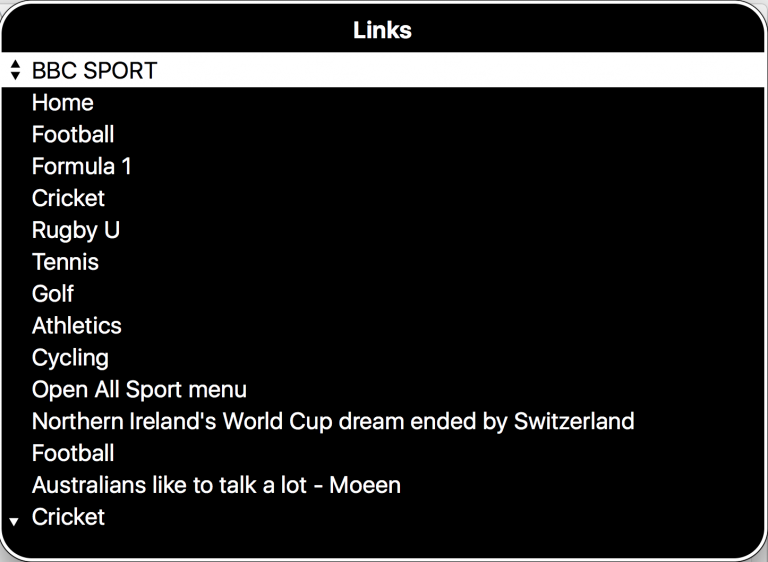
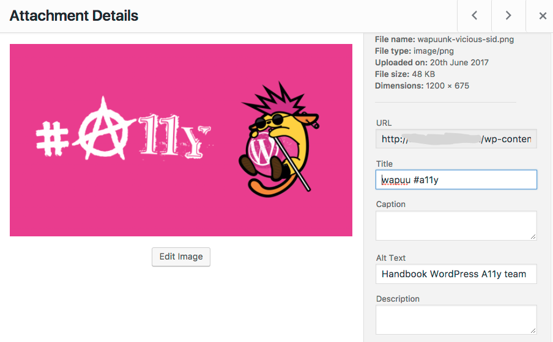

# Good link text

**Rule of thumb**: a link text should describe the resource that it links to, so that when the text is read out of context the user will still know what to expect.

Link text should stand on its own. Some assistive software scans a page for links and presents them to the user as a simple list. In these situations, all the links will be read out of context. So it is important the text used in a link is descriptive and meaningful.

It also makes your text easier to scan visually, so that sighted users can more quickly find the information they’re looking for.

Descriptive, meaningful link text in the Apple VoiceOver link list.

## Make links texts descriptive

### Avoid meaningless link text

- click here
- download
- info
- more
- here
- this

With these types of links, users have to read the whole sentence to understand the purpose of the link. This makes your content less browsable, and harder to engage with. Screen reader users cannot navigate by links, because those links are not useful without additional context.

Useless, non-descriptive link text in the Apple VoiceOver link list.

### Avoid fancy character combinations in your links

- ASCII art, example: \ō͡≡o˞̶
- Emoticons, example: <3
- Leetspeak, example: m8ts
- Excessive use of Emoji

ASCII art is invariably meaningless to screen reader users. Emoticons may occasionally be interpretable, but are confusing and difficult to understand. “Leetspeak” is unpronounceable, and creates difficult in comprehension. Emoji are independently accessible; they do have text alternatives. However, a large number of emoji can make the text effectively impossible to comprehend.

### Avoid writing links in all caps

Sequences of all capital letters are harder to read for people with dyslexia, screen readers may interpret short capitalized words as abbreviations, and read the words out character by character. This is also true if text is capitalized using CSS.

### Avoid using complete URLs as link text

Some URLs are highly readable, such as “wordpress.org”. Others are almost impossible to parse as language. In most cases, you should avoid using a URL as the visible link text. If you are explicitly referring to a web address, keep it short: [wordpress.org](https://www.wordpress.org/) instead of [https://www.wordpress.org](https://www.wordpress.org/).

### Examples

_Poor qualify (non-descriptive) link texts:_  
If you are interested in our work, [click here](#dummy-link) to subscribe to our newsletter. You can [download](#dummy-link) the manual of the espresso machine, or contact us for more [info](#dummy-link).

_Helpful (descriptive) link texts:_  
[Subscribe to our newsletter](#dummy-link) if you are interested in our work. You can download the [manual as a PDF](#dummy-link) of the espresso machine, or [contact us](#dummy-link) for more info.

## Images as links

For linked images, **the alt attribute** (the alternative text) will be the **link text**.

- It the **alt attribute describes the image**: the link text will be **the description of the image**, which is unlikely to clearly communicate the link purpose
- If there is **No alt attribute**: the link text will be the **image file name**
- If there is an **Empty alt attribute**: the link will have **no link text** and will be announced as “link”

So the proper way to use an image as a link is to describe the link destination in the `alt` text. If the image links to a post about the Accessibility Team’s handbook, add the alternative text “Accessibility Team Handbook”.

It is not necessary to ever use the word 'link' in your alt text; that will already be announced by the screen reader.
How to enter alternative text for an image that is used as a link.

How to enter alternative text for an image that is used as a link:

## Further Resources

- [Links and Hypertext](https://webaim.org/techniques/hypertext/link_text) by WebAIM
- [Don’t use “click here” as link text](https://www.w3.org/QA/Tips/noClickHere)
- [Why “Click here” is bad linking practice](http://jkorpela.fi/www/click.html)
- [Making Accessible Links: 15 Golden Rules For Developers](https://www.sitepoint.com/15-rules-making-accessible-links/)
- [Improving Link Display for Print](https://alistapart.com/article/improvingprint)

