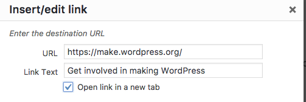

# Link destinations

**Rule of thumb**: Always tell a visitor what to expect when selecting a link.

## The link opens in a new window or tab

Opening a link in a new window or tab unexpectedly can disorient users. It also breaks the “back button”. The best practice is to let the user decide if she wants to open a link in a new tab or window.

Not all screen readers alert users when a new window or tab has opened and for those with cognitive disabilities, they may have trouble interpreting what’s happened.

This can be prevented by not checking “open link in a new target” on links so they don’t trigger new windows or tabs to open.

### But what if you insist?

If you absolutely need to open a link in a new window, you need to tell your visitor in the link text. For example:

> I love cats, so I watch [cat videos (will open in a new window)](#dummy-link) on YouTube.

## Link to a document

If the link opens a document, add the format of the document in the link text. For example:

_You can [download the manual as PDF](#dummy-url)._

## Avoid the title attribute on links

You should not use the title attribute on links, because the title attribute is only available for sighted users on desktop using a mouse. Other users will miss that information. In addition, screen readers announce the title attribute inconsistently. You must be sure that all users get the information they need and the title attribute doesn’t provide that.

## Resources

- [HTML5 Accessibility Chops: title attribute use and abuse](https://developer.paciellogroup.com/blog/2012/01/html5-accessibility-chops-title-attribute-use-and-abuse/) by Steve Faulkner
- [Don’t rely on the title attribute for accessibility](http://www.mediacurrent.com/blog/dont-rely-title-attribute-accessibility-seo)
- [(Don’t) Open Links in a New Window](https://www.postleaf.org/dont-open-links-in-a-new-window) by Cory LaViska
- [Should Links Open In New Windows?](https://www.smashingmagazine.com/2008/07/should-links-open-in-new-windows/) by Vitaly Friedman
- [When to use target="_blank"](https://css-tricks.com/use-target_blank/) by Chris Coyier

