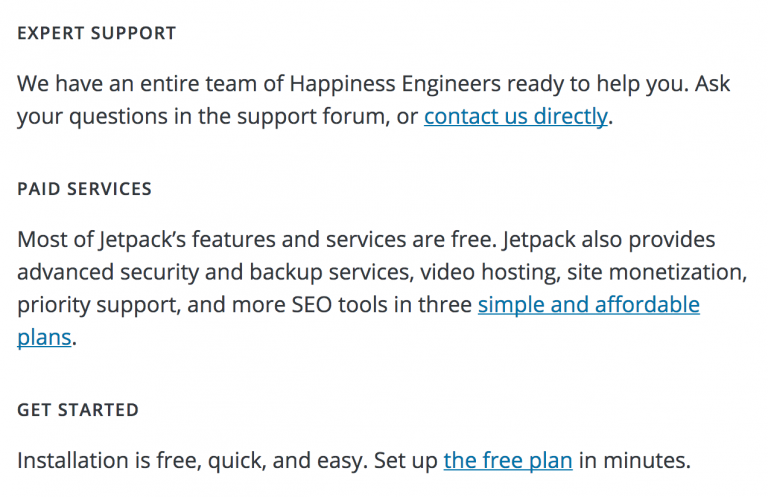
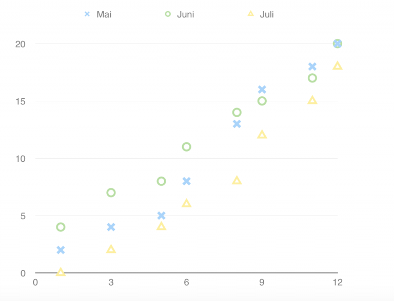
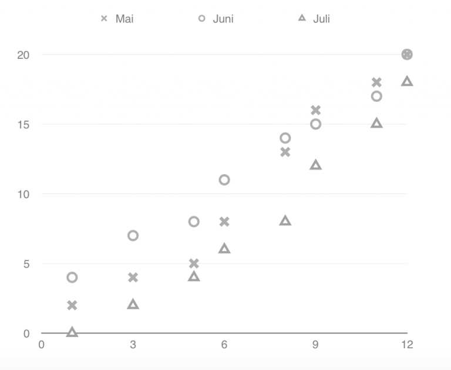
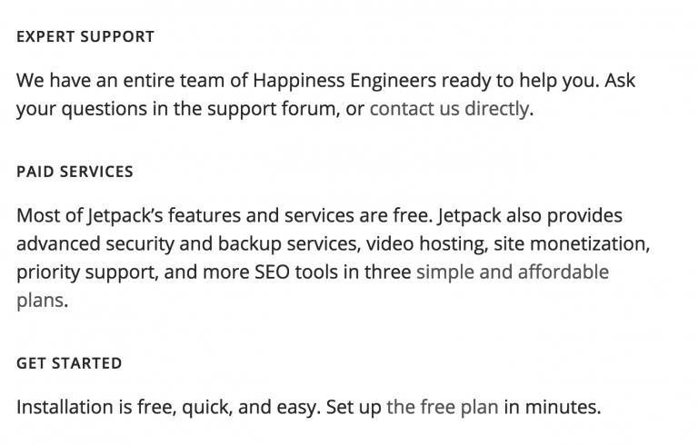
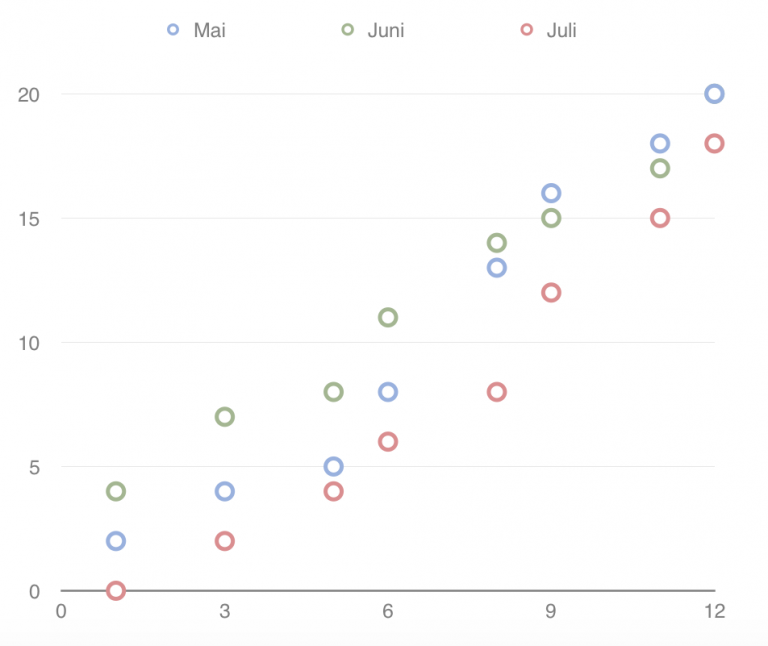
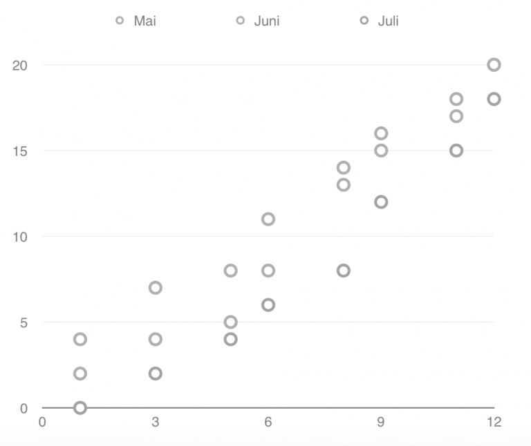

## Use of color

Color is important to make a beautiful website, but not everyone sees colors the same way. That’s why it’s important to check color contrast and use of color:

- Check the color contrast between foreground and background content
- Verify that color is not the only way of indicating controls or content

## Quick Tips

- Websites should be usable in grey scale – be cautious about uncomfortable color combinations like bright green and neon-yellow or very high color contrast
- Dark fonts on light backgrounds are easier to read for most people; but some users may need the reverse
- If using a light font on a dark background, you should use a slightly larger or thicker font than you might otherwise choose, so that it is still easy to read

## Color Contrast

Color contrast is an important issue to address for the accessibility of your website. It should be considered for foreground (text and other elements) and background colors (or images), but also between elements and hover or focus states.

Color contrast should be high enough for good readability, but should not be too bright for people with sensitive eyes or cognitive problems.There are no WCAG criteria defining excessively high contrast, but very high contrast should be used selectively.

The WordPress project follows the [accessibility level “AA”  of WCAG](http://www.w3.org/TR/UNDERSTANDING-WCAG20/visual-audio-contrast-contrast.html).

This requires that the contrast between background and foreground colors has a luminosity contrast ratio of:

- 4.5:1 for normal text
- 3:1 for [large text (24px equivalent or 19px equivalent and bold)](http://mcdpartners.com/lab/meeting-wcag-color-contrast-guideline/)

There are many tools to check color contrast ratios. WebAxe published an overview of contrast checkers.

## Not by color alone

Using color to differentiate between elements on a page is fine. However, you should avoid using color as the only visual means to differentiate parts of a page. For example,

- error, success, or note messages
- links in the content
- active, hover or focus states
- display information updates

Use additional styling to indicate types of information including a change of shape or decoration. For example:

- Change symbols in addition to color
- Underline links that are embedded in text

Grouped links in sidebars, footers, or in navigation menus frequently don’t need to be underlined. If it is obvious in context that the text is a link, underlines are not required. However, in many cases underlining can increase the usability of your website.

## Examples

### Correct

Underline your links, which are placed between text.

Undelined links are easier to see.

Use symbols and colors in graphics.

Graphic with differently shaped symbols in black in white.

### Incorrect

Links not underlined – color blind users may have trouble distinguish links from text.

Can you see the links now?

Color used as the only indicator for information or functionality

The easiest way to check whether your website is usable for colorblind people is to test it in grayscale. When the color information is extracted, you can more easily see whether your website is still understandable.

## Resources

### Guidelines

- [WCAG Contrast Minimum](http://www.w3.org/TR/UNDERSTANDING-WCAG20/visual-audio-contrast-contrast.html)
- [WCAG Color Contrast Guideline](http://mcdpartners.com/lab/meeting-wcag-color-contrast-guideline/)
- [Color Contrast and why you should rethink it](https://www.smashingmagazine.com/2014/10/color-contrast-tips-and-tools-for-accessibility/)

### Tools

You can test color contrast with these color checkers:

- [Overview of all sorts of contrast checkers](http://www.webaxe.org/color-contrast-tools/)
- [WebAIM Contrast Checker](http://webaim.org/resources/contrastchecker/)
- [Background Image & Text Contrast Checker](http://www.brandwood.com/a11y/)

### Good reads

- [On link underlines](http://adrianroselli.com/2016/06/on-link-underlines.html) by Adrian Roselli.
- [Assistive Technology Experiment: High Contrast](https://webaim.org/blog/high-contrast/)
- [Color Contrast And Why You Should Rethink It](https://www.smashingmagazine.com/2014/10/color-contrast-tips-and-tools-for-accessibility/)
- [Keep the underline](http://www.webaxe.org/keep-the-underline-text-links/)

